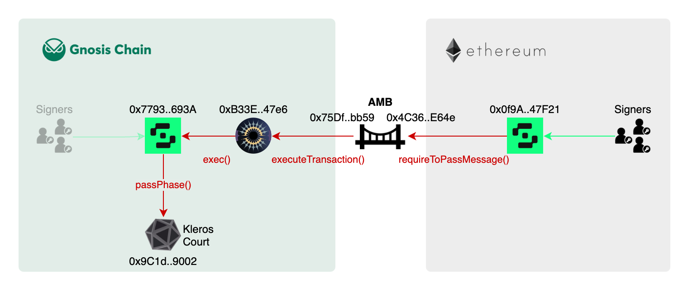
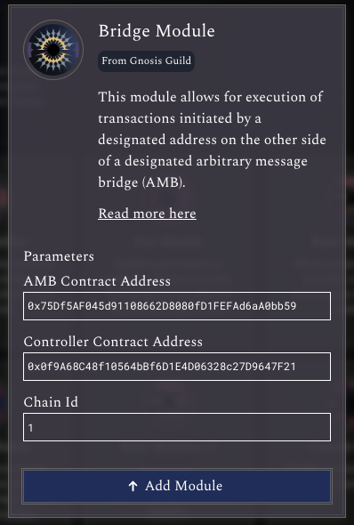
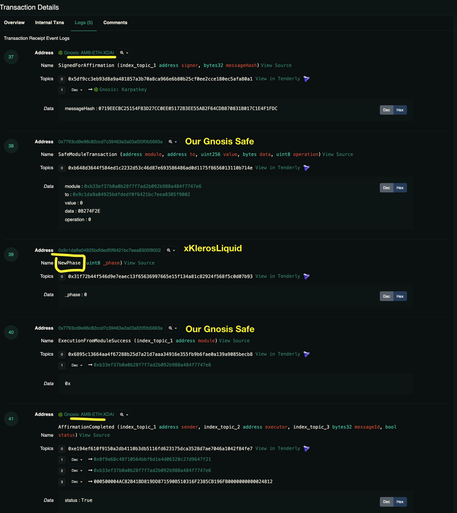
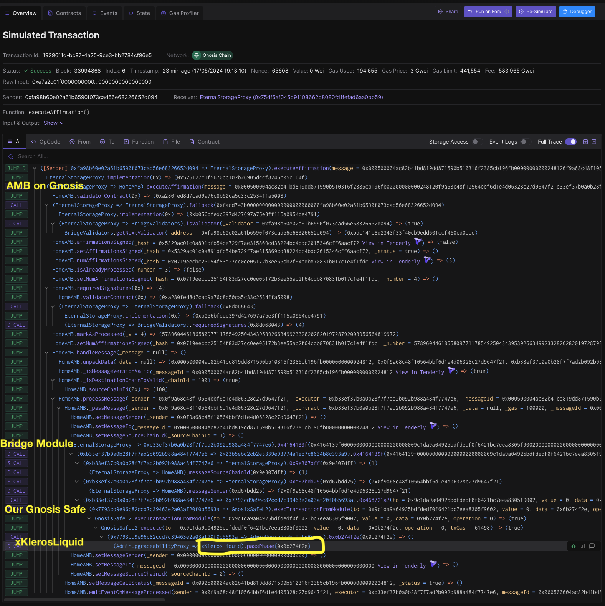
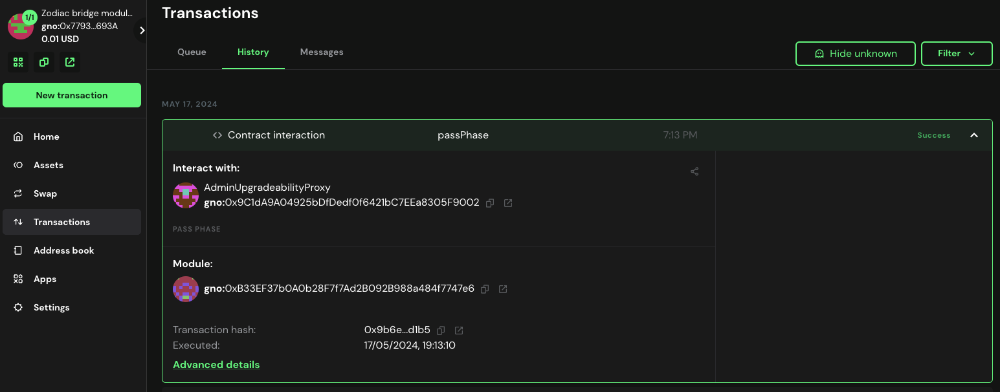

# Zodiac Bridge Module Example

We want to control a Safe on Gnosis Chain from a Safe on Ethereum.

## Setup



**Ethereum Safe** = message sender
- https://app.safe.global/home?safe=eth:0x0f9A68C48f10564bBf6D1E4D06328c27D9647F21

**Gnosis Safe** = message receiver, governor
- https://app.safe.global/home?safe=gno:0x7793Cd9e96C82CCD7C39463e2a03af20F0b5693A

**Bridge Module** installed on the Gnosis Safe
- https://app.safe.global/apps/open?safe=gno:0x7793Cd9e96C82CCD7C39463e2a03af20F0b5693A&appUrl=https%3A%2F%2Fzodiac.gnosisguild.org%2F
- https://gnosisscan.io/address/0xB33EF37b0A0b28F7f7Ad2B092B988a484f7747e6

With the parameters
- **AMB Contract Address** = [Gnosis chain AMB](https://gnosisscan.io/address/0x75Df5AF045d91108662D8080fD1FEFAd6aA0bb59) = msg.sender from the Bridge module's point of view
- **Controller** = Sender on Ethereum = Ethereum Safe
- **Chain ID** = Ethereum



## Encoding the call chain

We want to call:
`Ethereum Safe -> AMB -> Bridge Module -> Gnosis Safe -> xKlerosLiquid.passPhase()`

```typescript
// We start from last call
xKlerosLiquid = 0x9C1dA9A04925bDfDedf0f6421bC7EEa8305F9002
    .passPhase() = 0x0b274f2e

// Then we wrap this with the Bridge Module call
bridgeModule = 0xB33EF37b0A0b28F7f7Ad2B092B988a484f7747e6
    .executeTransaction(
        address xKlerosLiquid = 0x9C1dA9A04925bDfDedf0f6421bC7EEa8305F9002, 
        value = 0, 
        bytes = 0x0b274f2e,
        operation = 0 // (0) call or (1) delegate call
    ) = 0x4164139f0000000000000000000000009c1da9a04925bdfdedf0f6421bc7eea8305f900200000000000000000000000000000000000000000000000000000000000000000000000000000000000000000000000000000000000000000000000000000080000000000000000000000000000000000000000000000000000000000000000000000000000000000000000000000000000000000000000000000000000000040b274f2e00000000000000000000000000000000000000000000000000000000

// Finally we wrap this with the AMB call on the sending side
AMBEthereum = 0x4C36d2919e407f0Cc2Ee3c993ccF8ac26d9CE64e
    .requireToPassMessage(
        address _bridgeModule = 0xB33EF37b0A0b28F7f7Ad2B092B988a484f7747e6,
        bytes _data = 0x4164139f0000000000000000000000009c1da9a04925bdfdedf0f6421bc7eea8305f900200000000000000000000000000000000000000000000000000000000000000000000000000000000000000000000000000000000000000000000000000000080000000000000000000000000000000000000000000000000000000000000000000000000000000000000000000000000000000000000000000000000000000040b274f2e00000000000000000000000000000000000000000000000000000000,
        uint256 _gas = 100000
    ) = 0xdc8601b3000000000000000000000000b33ef37b0a0b28f7f7ad2b092b988a484f7747e6000000000000000000000000000000000000000000000000000000000000006000000000000000000000000000000000000000000000000000000000000186a000000000000000000000000000000000000000000000000000000000000000c44164139f0000000000000000000000009c1da9a04925bdfdedf0f6421bc7eea8305f900200000000000000000000000000000000000000000000000000000000000000000000000000000000000000000000000000000000000000000000000000000080000000000000000000000000000000000000000000000000000000000000000000000000000000000000000000000000000000000000000000000000000000040b274f2e0000000000000000000000000000000000000000000000000000000000000000000000000000000000000000000000000000000000000000

```

This last step can be done directly in the Transaction Builder UI. Remember to override the ABI because the contract is a proxy, give it [the implementation ABI](https://etherscan.io/address/0x82b67a43b69914e611710c62e629dabb2f7ac6ab#code).


## Sending from the Ethereum Safe

We [send the transaction](https://etherscan.io/tx/0xfa0496f5be6e21306dbbc0d7675e977bec5c32eb83836484c140e40c885a8696#eventlog) from the Ethereum Safe, it is messageId `0x000500004AC82B41BD819DD871590B510316F2385CB196FB0000000000024812`


Then we wait for ~30 minutes (100 Gnosis chain blocks) for until [messageCallStatus()](https://gnosisscan.io/address/0x75Df5AF045d91108662D8080fD1FEFAd6aA0bb59#readProxyContract#F23) returns `true`.


## Execution via the Gnosis Safe
Message successfully received after 27 minutes, [the transaction has been executed](https://gnosisscan.io/tx/0x9b6e4e1e8d3c76ead0484e04715bf4674fbb3d3aa5f6617a7fc6f80b0d8fd1b5/advanced#eventlog) by one of the AMB relayers (Karpatkey in this example)



#### [Trace on Tenderly](https://www.tdly.co/shared/simulation/1929611d-bc97-4a25-9ce3-bb2784cf96e5)



#### [Safe wallet transaction record](https://app.safe.global/transactions/tx?safe=gno:0x7793Cd9e96C82CCD7C39463e2a03af20F0b5693A&id=module_0x7793Cd9e96C82CCD7C39463e2a03af20F0b5693A_i9b6e4e1e8d3c76ead0484e04715bf4674fbb3d3aa5f6617a7fc6f80b0d8fd1b50,2,0,2,0)



----

## Resources
- [Bridge Module](https://zodiac.wiki/index.php%3Ftitle=Category:Bridge_Module.html)
- [Bridge Module: Operator Tutorial](https://zodiac.wiki/index.php%3Ftitle=Bridge_Module:_Operator_Tutorial.html)
- [Zodiac Bridge Module Setup Guide](https://github.com/gnosisguild/zodiac-module-bridge/blob/main/docs/setup_guide.md)
- [AMBModule.sol](https://github.com/gnosisguild/zodiac-module-bridge/blob/main/contracts/AMBModule.sol)

#### Most relevant code

This function makes the Gnosis Safe execute anything, by-passing the multi-signature scheme.

```solidity
contract AMBModule is Module {
    /// @dev Executes a transaction initated by the AMB
    /// @param to Target of the transaction that should be executed
    /// @param value Wei value of the transaction that should be executed
    /// @param data Data of the transaction that should be executed
    /// @param operation Operation (Call or Delegatecall) of the transaction that should be executed
    function executeTransaction(
        address to,
        uint256 value,
        bytes memory data,
        Enum.Operation operation
    ) public {
        require(msg.sender == address(amb), "Unauthorized amb");
        require(amb.messageSourceChainId() == chainId, "Unauthorized chainId");
        require(amb.messageSender() == controller, "Unauthorized controller");
        require(exec(to, value, data, operation), "Module transaction failed");
    }
}

```